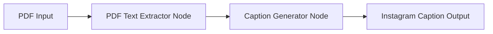

# Design Document

## Overview

The news article Instagram agent is a simple sequential workflow built with LangGraph that processes PDF files containing news articles and generates Instagram captions using OpenAI's language model. The system follows a linear two-step process: extract text from PDF, then generate caption via OpenAI API.

## Architecture

The system uses a straightforward pipeline architecture with two main processing nodes connected in sequence:



### Core Components:
- **LangGraph Workflow**: Orchestrates the sequential execution
- **PDF Text Extractor**: Extracts readable text from PDF files
- **Caption Generator**: Uses OpenAI API to create Instagram captions
- **State Management**: Passes data between workflow nodes

## Components and Interfaces

### 1. LangGraph Workflow (`InstagramCaptionWorkflow`)

**Purpose**: Orchestrates the sequential execution of PDF processing and caption generation

**Interface**:
```python
class WorkflowState(TypedDict):
    pdf_path: str
    extracted_text: str
    instagram_caption: str
    error: Optional[str]

def create_workflow() -> StateGraph:
    # Returns configured LangGraph workflow
```

**Responsibilities**:
- Initialize workflow state with PDF path
- Execute nodes in sequence
- Handle state transitions between nodes
- Manage error propagation

### 2. PDF Text Extractor Node (`pdf_extractor_node`)

**Purpose**: Extracts text content from PDF files

**Interface**:
```python
def pdf_extractor_node(state: WorkflowState) -> WorkflowState:
    # Extracts text from PDF and updates state
```

**Dependencies**:
- `PyPDF2` or `pdfplumber` for PDF text extraction

**Responsibilities**:
- Read PDF file from provided path
- Extract all readable text content
- Handle PDF parsing errors
- Update workflow state with extracted text

### 3. Caption Generator Node (`caption_generator_node`)

**Purpose**: Generates Instagram captions using OpenAI API

**Interface**:
```python
def caption_generator_node(state: WorkflowState) -> WorkflowState:
    # Generates Instagram caption and updates state
```

**Dependencies**:
- `openai` Python client
- OpenAI API key configuration

**Responsibilities**:
- Format article text for OpenAI prompt
- Call OpenAI API with Instagram caption prompt
- Handle API errors and rate limiting
- Update workflow state with generated caption

### 4. Main Execution Interface

**Purpose**: Provides simple entry point for running the agent

**Interface**:
```python
def generate_instagram_caption(pdf_path: str) -> str:
    # Main function to execute the workflow
```

## Data Models

### WorkflowState
```python
class WorkflowState(TypedDict):
    pdf_path: str              # Input PDF file path
    extracted_text: str        # Text extracted from PDF
    instagram_caption: str     # Generated Instagram caption
    error: Optional[str]       # Error message if any step fails
```

### Configuration
```python
class AgentConfig:
    openai_api_key: str
    openai_model: str = "gpt-4"
    max_text_length: int = 8000  # Limit for OpenAI context
```

## Error Handling

### PDF Processing Errors
- **File not found**: Clear error message with file path
- **Corrupted PDF**: Graceful handling with error state update
- **Empty PDF**: Warning message, continue with empty text
- **Permission errors**: File access error reporting

### OpenAI API Errors
- **API key missing**: Configuration error with setup instructions
- **Rate limiting**: Retry logic with exponential backoff
- **API failures**: Error capture with original text preservation
- **Token limits**: Text truncation with warning

### Workflow Errors
- **Node failures**: Error propagation through workflow state
- **State corruption**: Validation and recovery mechanisms
- **Timeout handling**: Configurable timeouts for each node

## Testing Strategy

### Unit Tests
- **PDF Extractor**: Test with various PDF formats and edge cases
- **Caption Generator**: Mock OpenAI API responses for consistent testing
- **Workflow Nodes**: Individual node testing with controlled state inputs

### Integration Tests
- **End-to-End Workflow**: Complete PDF to caption generation
- **Error Scenarios**: Test error handling across all components
- **API Integration**: Test with real OpenAI API (separate test suite)

### Test Data
- **Sample PDFs**: Various news article formats and sizes
- **Expected Outputs**: Reference Instagram captions for validation
- **Error Cases**: Corrupted PDFs, empty files, invalid formats

## Implementation Notes

### OpenAI Prompt Design
The caption generator will use a carefully crafted prompt to ensure Instagram-optimized output:

```
You are an expert social media manager. Create an engaging Instagram caption for this news article.

Requirements:
- Keep it concise and engaging (100-150 words)
- Include 3-5 relevant hashtags
- Add appropriate emojis
- Include a call-to-action
- Maintain the article's key message

Article text: {extracted_text}
```

### Dependencies
- `langgraph`: Workflow orchestration
- `pdfplumber`: PDF text extraction (preferred over PyPDF2 for better text handling)
- `openai`: OpenAI API client
- `python-dotenv`: Environment variable management
- `typing`: Type hints for better code clarity

### File Structure
```
/
├── src/
│   ├── agent/
│   │   ├── __init__.py
│   │   ├── workflow.py      # LangGraph workflow definition
│   │   ├── nodes.py         # Individual workflow nodes
│   │   └── config.py        # Configuration management
│   ├── utils/
│   │   └── pdf_utils.py     # PDF processing utilities
│   └── main.py              # Entry point
├── tests/
│   ├── test_workflow.py
│   ├── test_nodes.py
│   └── test_data/
│       └── sample_articles/ # Test PDF files
├── requirements.txt
└── .env.example
```